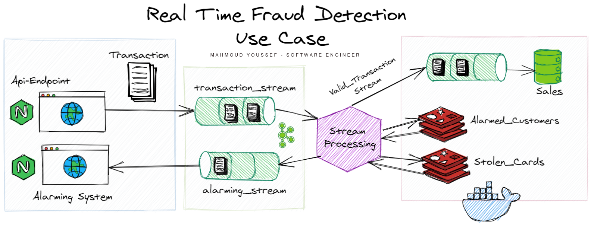

# real-time-fraud-detection

Real Time Fraud Detection System based on "Stream Processing". The logic behind the fraud detection is as follows :
* The transaction is considered as a fraud if there 're more than 10 transaction per minute with same customerId.
* The transaction is considered as a fraud if there 're more than 2 different cities with same customerId.
* The transaction is considered as a fraud if the creditcard was reported.
* The transaction is considered as a fraud if the customer was previously alarmed by the alarming system.

The System consists of Api Endpoint for receiveing transactions, after that all requests goes through a data pipeline started with Apache Kafka which considered as a most used Distributed Streaming Platform. Then Flink Job is running which consumes from Kafka topic the upcoming transactions to decide if it was a fraud or not. If the transaction is considered as a Fraud it should be passed through another Kafka topic for alarms which is consumed by an Alarming System. The valid ones are passed to another Kafka topic to be sinked in MongoDB for being successfull. Checking the transaction against stolen cards or previously alarmed customers are done using In Memory Database which is Redis.

## Technologies Uses :
* NodeJS
* MongoDB
* Redis
* Apache Kafka
* Apache Flink
* Docker

